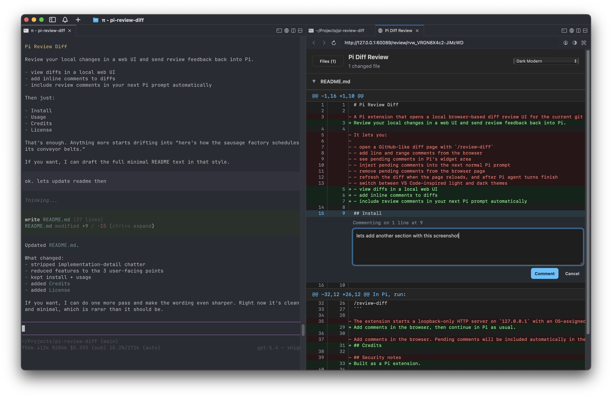

# Pi Review Diff

Review your local changes in a web UI and send review feedback back into Pi.

- review the entire branch against `main`, including committed and local changes
- switch between **Branch**, **Uncommitted**, live **Active turn**, and **Last turn** views
- syntax highlighting for Swift, Kotlin, TypeScript/JavaScript, HTML, and CSS
- stream live per-turn file and line counts while Pi is working
- add inline comments to diffs
- include review comments in your next Pi prompt automatically

## Screenshot



## Install

```bash
pi install git:github.com/gavrix/pi-review-diff@v0.1.0
```

Then reload Pi resources:

```text
/reload
```

## Usage

In Pi, run:

```text
/review-diff
```

The review opens on **Branch**, comparing the current worktree with the merge base of `main`. Use the change selector to switch to:

- **Uncommitted** — the current worktree compared with `HEAD`
- **Active turn** — a read-only live diff that appears while Pi is running and updates after file-changing tools complete
- **Last turn** — only the changes made during Pi's most recently completed turn

Untracked files are included. Click the live activity pill to open **Active turn**; its dropdown entry lists the files changing so far. Add comments in the browser, then continue in Pi as usual. Pending comments are injected into the next normal prompt, marked as sent immediately, and considered resolved when that Pi run finishes.

## Security

The review server listens only on `127.0.0.1`. Each review uses a random, unguessable ID in its local URL; review data lives only in the Pi process and disappears when that process or session shuts down.

## Credits

Built as a Pi extension.

## License

MIT. See [LICENSE](./LICENSE).
